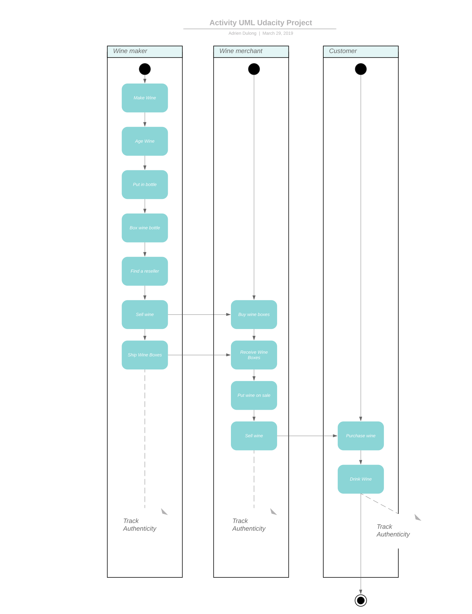
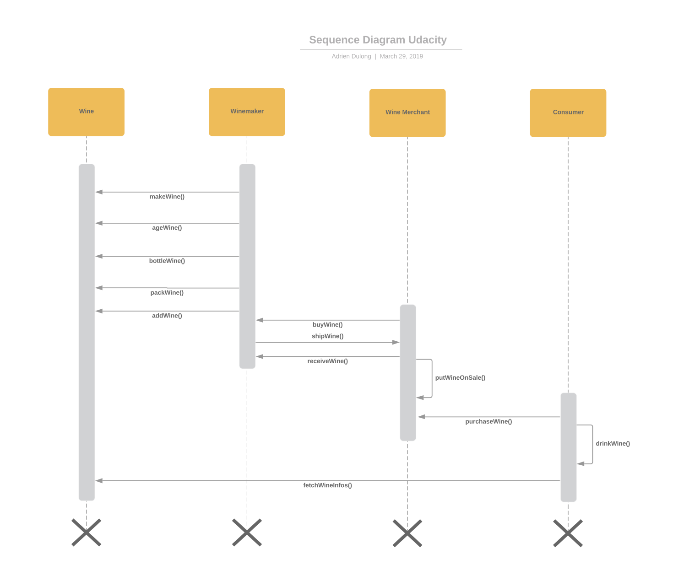
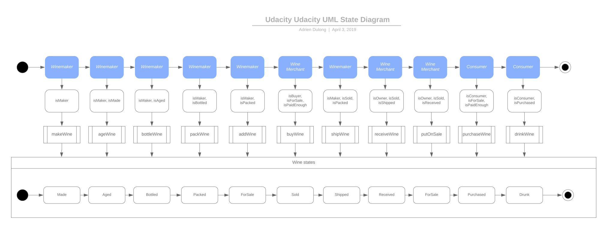
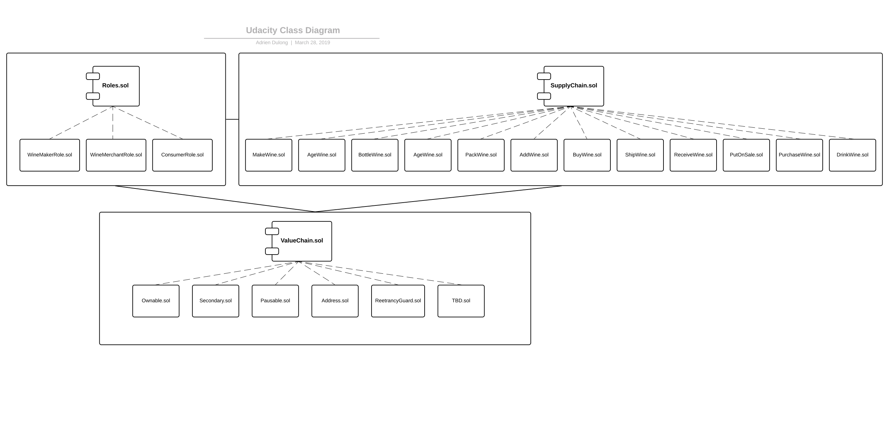

# Supply Chain Smart Contracts

This project implements smart contracts that simulate a wine supply chain.
This project is part of the Udacity Blockchain Nanodegree.

## UML Diagrams

Here are the diagrams that has been done to show the architecture of the project.
As you can see the supply chain flow has been simplified a lot. The idea wan not to match with an exact supplu chain situation
but to have an interesting use of solidity and smart contracts.

**Activity UML Diagram**

**Sequence UML Diagram**

**State UML Diagram**

**Class UML Diagram**

## Libraries

**Roles from OpenZeppelin**: Roles library is used in order to manage the different access and authorization for different users. I used the [OpenZeppelin implementation](https://github.com/OpenZeppelin/openzeppelin-solidity/blob/master/contracts/access/Roles.sol)

**Pausable contract from OpenZeppelin**: This contract is used in order to be able to Pause a contract. I used the [OpenZeppelin implementation](https://github.com/OpenZeppelin/openzeppelin-solidity/blob/master/contracts/lifecycle/Pausable.sol)

**Ownable contract from OpenZeppelin**: This contract is used in order to assign an owner to the contract and being able to transfer the ownership. I used the [OpenZeppelin implementation](https://github.com/OpenZeppelin/openzeppelin-solidity/blob/master/contracts/ownership/Ownable.sol)

**SafeMath from OpenZeppelin**:  I use this library in order to avoid overflow or underflow of uint. [OpenZeppelin SafeMath implementation](https://github.com/OpenZeppelin/openzeppelin-solidity/blob/master/contracts/math/SafeMath.sol)

## Rinkeby Deployment

The smart contracts have been deployed to the rinkeby testnet .
Here are the infos:
* Transaction Hash: [0xf4d740133d6c18fe7d242c6a24afd0e346b85889f36ca7acf52d4acd0e690fe5](https://rinkeby.etherscan.io/tx/0xf4d740133d6c18fe7d242c6a24afd0e346b85889f36ca7acf52d4acd0e690fe5)
* Contract address: [0x9F355832fFC582f169de963a48CA97018975EfBA](https://rinkeby.etherscan.io/address/0x9F355832fFC582f169de963a48CA97018975EfBA)

## Launch local server and deploy on a local blockchain

In order to launch the local server that will allow you to test the smart contract with the UI do this:
1. Go to the root of the project and do a `yarn install` or `npm install`
2. Do a `cd client`
3. Do a `yarn install` or `npm install`
4. Do a `yarn start` or `npm run start`

A local server will start on `localhost:3000`.

In order to use the app you'll have to have Metamask install.

You can either connect to the Rinkeby testnetwork, however you won't be able to use the app since you are not admin, except if you deploy it again with you account.

Or you can launch a local blockchain doing `npm run chain` from the root of the project, and then launching the local server as describded above. If you choose this option you'll have to set a custom RPC connection on metamask on `http://localhost:7545`